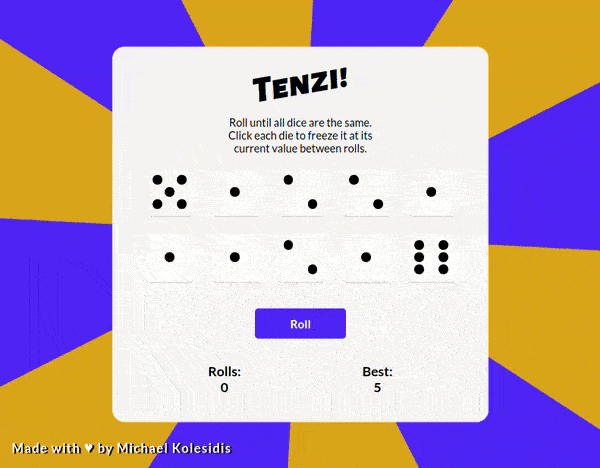
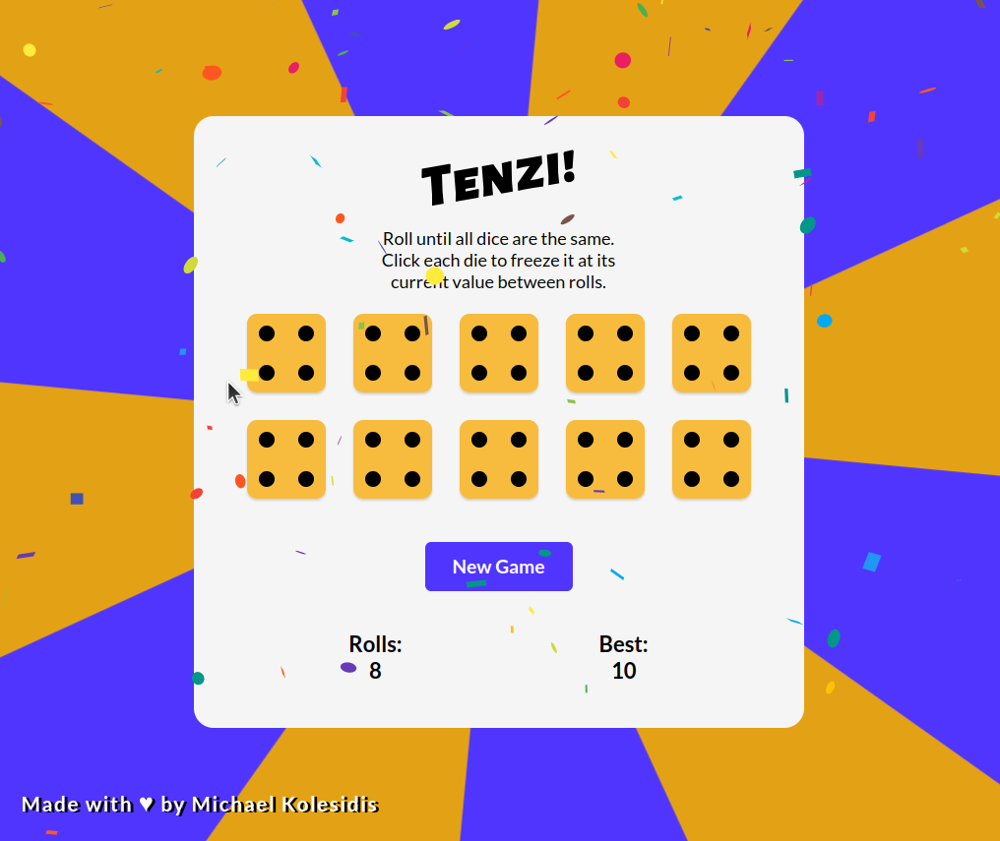
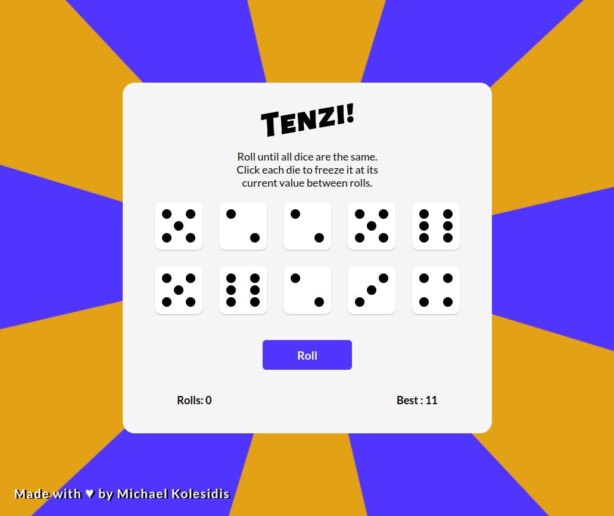

  
  <h1></h1>
  
  <h3>Roll until all dice are the same</h3>

## Technologies Used

&nbsp;&nbsp;&nbsp;&nbsp;&nbsp;&nbsp;

&nbsp;&nbsp;&nbsp;&nbsp;&nbsp;&nbsp;

## Description

Tenzi is a dice game used to demonstrate the use of React Hooks (useState, useEffect).

The player needs to roll dice until they are all the same. Clicking on a dice, freezes it at its current value between rolls

Best scores are saved to local storage.

## Screenshots

## License

Copyright (c) Michael Kolesidis 
Licensed under the [GNU Affero General Public License v3.0](https://www.gnu.org/licenses/agpl-3.0.html).
